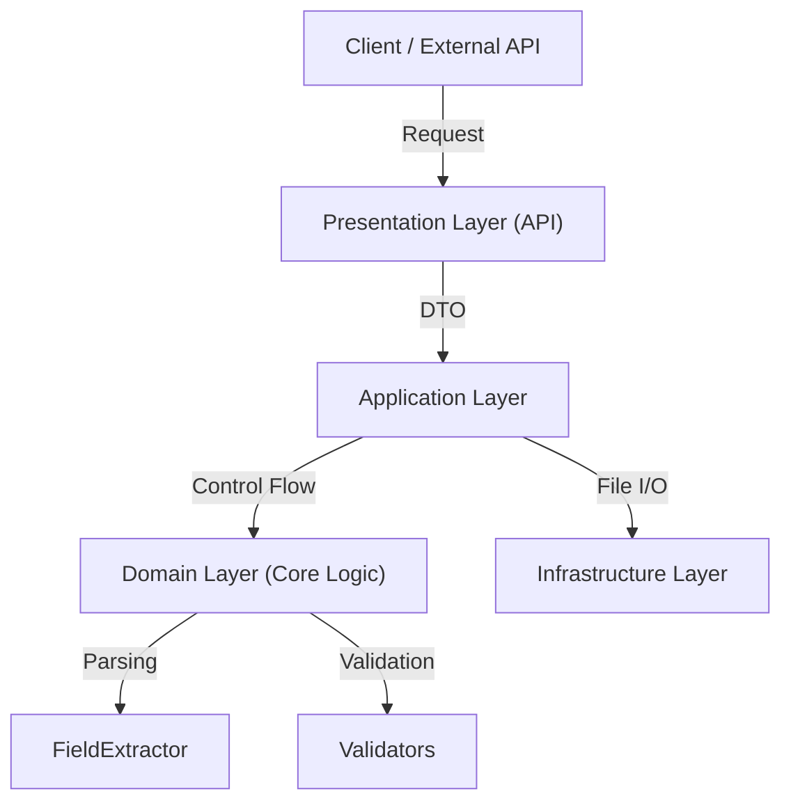

# OCR 파싱 API 프로젝트 (OCR Parsing & Validation Service)

## 1. 프로젝트 개요
본 프로젝트는 **계량증명서**와 같은 비정형 OCR 데이터를 입력받아, 서비스에서 활용 가능한 표준화된 데이터로 변환(Parsing)하고, 비즈니스 규칙에 따라 데이터의 정합성을 검증(Validation)하는 API 서버입니다.

## 2. 설계 철학 및 아키텍처 (Architecture & Design)

### 2.1 왜 자체 파싱 로직(Rule-based Parsing)을 선택했는가?
일반적인 **딥러닝 기반 파싱 모델(NLP)** 대신, **규칙 기반(Rule-based)** 접근 방식을 선택했습니다.

1.  **데이터 트레이드오프(Data Trade-off)**: 딥러닝 모델은 학습을 위해 방대한 양의 라벨링 데이터가 필요합니다. 본 과제와 같이 **소량의 샘플 데이터**만 주어진 환경에서는 규칙 기반 접근이 훨씬 효율적이며 즉각적인 성과를 낼 수 있습니다.
2.  **결과의 설명 가능성(Explainability)**: 확률에 의존하는 AI 모델과 달리, 규칙 기반 파싱은 "왜 이 값이 추출되었는지(또는 실패했는지)" 명확하게 설명할 수 있어 디버깅과 유지보수가 용이합니다.
3.  **한계와 유연한 설계**: 새로운 양식의 문서가 등장하면 규칙(정규식 등)을 추가해야 하는 번거로움이 있습니다. 이를 보완하기 위해 `FieldExtractor`를 통해, 새로운 패턴이 발견될 때마다 유연하게 로직을 확장할 수 있도록 유연성을 확보했습니다.

### 2.2 레이어드 아키텍처 (Layered Architecture)
본 프로젝트는 **관심사의 분리(Separation of Concerns)** 원칙에 따라 4계층 아키텍처를 채택했습니다.



### 아키텍처 구조도 (Structure Diagram)
```
┌─────────────────────────────────────────────────────────────┐
│                    Presentation Layer                       │
│  ┌────────────────────┐  ┌────────────────────────────────┐ │
│  │ OcrParseController │  │ DTO (Response/BatchResult)     │ │
│  └────────────────────┘  └────────────────────────────────┘ │
├─────────────────────────────────────────────────────────────┤
│                    Application Layer                        │
│  ┌─────────────────────────────────────────────────────┐    │
│  │                  OcrParseService                    │    │
│  │         (비즈니스 로직 조율 및 파이프라인 관리)         │    │
│  └─────────────────────────────────────────────────────┘    │
├─────────────────────────────────────────────────────────────┤
│                      Domain Layer                           │
│  ┌──────────────┐    ┌───────────────────────────────────┐  │
│  │FieldExtractor│    │            Validators             │  │
│  │  (필드 추출)  │    │     (중량/차량/날짜/GPS 검증)       │  │
│  └──────────────┘    └───────────────────────────────────┘  │
├─────────────────────────────────────────────────────────────┤
│                   Infrastructure Layer                      │
│  ┌─────────────────┐                                        │
│  │  OcrFileReader  │                                        │
│  │ (OCR 파일 읽기)  │                                        │
│  └─────────────────┘                                        │
└─────────────────────────────────────────────────────────────┘
```

*   **Presentation Layer (`api`)**: 외부 요청을 받고 응답을 반환하는 역할. HTTP 통신과 데이터 변환(DTO)에 집중합니다.
*   **Application Layer (`application`)**: 비즈니스 프로세스의 **흐름**을 제어합니다. 도메인 객체들을 조립하여 '파싱 및 검증'이라는 하나의 작업을 수행합니다.
*   **Domain Layer (`domain`)**: 프로젝트의 **핵심 비즈니스 로직**이 존재하는 곳입니다. 외부 라이브러리나 프레임워크에 의존하지 않는 순수 자바 코드로 작성되어 테스트가 용이합니다.
*   **Infrastructure Layer (`infrastructure`)**: 파일 시스템 접근, 외부 API 호출 등 기술적인 세부 구현을 담당합니다.

## 3. 주요 컴포넌트 설계 (Component Design)

### 3.1 FieldExtractor (데이터 추출기)
OCR 결과 JSON은 `images > fields` 배열 내에 데이터가 존재하거나, `result` 객체 내에 존재할 수 있습니다. `FieldExtractor`는 이러한 구조적 차이를 추상화하여, **어떤 JSON이 들어오든 동일한 방식(`extractVehicleNumber`, `extractTotalWeight` 등)으로 데이터를 꺼낼 수 있도록** 합니다.
- **역할**: JSON 트리 탐색, Null-Safety 처리, 데이터 정규화(공백 제거 등)

### 3.2 Validators (검증기)
추출된 데이터가 비즈니스적으로 올바른지 판단합니다. 각 Validator는 단일 책임 원칙(SRP)을 따릅니다.

*   **`WeightValidator`**:
    *   **Logic**: 문자열로 된 중량 데이터를 숫자로 변환합니다. `총중량 - 공차중량 - 실중량`의 절대값 차이가 허용 오차(Tolerance) 이내인지 검증합니다.
*   **`VehicleValidator`**:
    *   **Logic**: 차량번호 정규식(`\d{2,3}[가-타]\d{4}`)을 사용하여 형식을 검증합니다.
*   **`DateTimeValidator`**:
    *   **Logic**: 다양한 날짜 포맷(`yyyy-MM-dd`, `yyyy.MM.dd`, `MM/dd/yyyy`)을 시도하여 유효한 `LocalDate`로 변환되는지 확인합니다.
*   **`GpsValidator`**:
    *   **Logic**: 위도/경도가 대한민국 범위 내에 존재하는지, 유효한 좌표값인지 검증합니다.

### 3.3 Data Transfer Objects (DTO)
*   **`ParsedResultResponse`**: 클라이언트에게 반환되는 최종 응답 객체입니다. 파싱된 데이터뿐만 아니라, **각 필드별 검증 결과(`VALID`/`INVALID`)와 사유**를 포함하여 클라이언트가 문제 원인을 파악할 수 있게 설계되었습니다.

### 3.4 데이터 흐름 (Data Flow)
```
1. 파일 읽기      [Infrastructure] OcrFileReader
        ↓
2. 필드 추출      [Domain] FieldExtractor (정규표현식/키워드 탐색) -> 정규화 수행
        ↓
3. 데이터 검증    [Domain] Validators (중량, 차량번호, 날짜, GPS)
        ↓
4. 결과 생성      [API] ParsedResultResponse (검증 결과 포함 DTO)
```

### 3.5 프로젝트 구조 (Project Structure)
```
src/main/java/RECO/Internship/Assignment/
├── AssignmentApplication.java
├── DemoClient.java                 # 데모 클라이언트
├── api/
│   ├── controller/
│   │   └── OcrParseController.java # API 엔드포인트
│   └── dto/
│       ├── BatchParseResult.java
│       └── ParsedResultResponse.java
├── application/
│   └── OcrParseService.java        # 서비스 로직
├── domain/
│   ├── parser/
│   │   └── FieldExtractor.java     # 핵심 파싱 로직
│   └── validator/
│       ├── WeightValidator.java
│       ├── VehicleValidator.java
│       ├── DateTimeValidator.java
│       └── GpsValidator.java
└── infrastructure/
    └── file/
        └── OcrFileReader.java      # 파일 I/O
```

## 4. 실행 방법 (How to Run)

### 사전 요구사항
*   JDK 17 이상 설치
*   터미널 환경 (Mac/Linux/Windows WSL)

### 1) 서버 실행
SpringBoot 애플리케이션을 실행합니다. (기본 포트: 8080)
```bash
./gradlew bootRun
```

### 2) 데모 클라이언트 실행
서버가 실행 중인 상태에서, 별도의 터미널을 열어 데모 클라이언트를 실행합니다.
제공된 샘플 데이터(`[2026 ICT_리코] smaple_data_ocr`)를 서버로 전송하고 결과를 확인합니다.
```bash
./gradlew runDemo
```

### 3) 테스트 실행
작성된 단위 테스트 및 통합 테스트를 수행합니다.
```bash
./gradlew test
```
